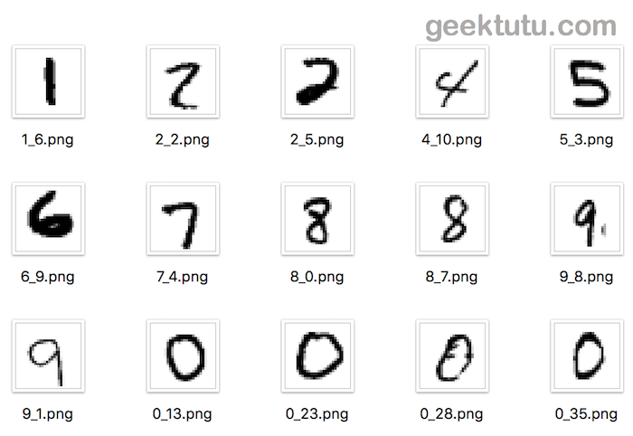

在之前的几篇文章中，我们都是通过  `tensorflow.examples.tutorials.mnist`来使用mnist训练集集，制作训练集主要有2个目的，一是加快训练时读取的速度，而是支持随机批读取。假如，每次训练时，都是直接读取图片，再将图片转为矩阵进行训练，那这样效率无疑是非常低下的。

这篇文章将使用numpy 和 h5py（HDF5文件格式）2种方式来制作训练集，并对这两种方式进行对比。

## 准备图片


直接读取tensorflow中mnist数据集，将数据集还原为图片。

在这里，使用 pillow库将矩阵转为图片。

```python
import numpy as np
from PIL import Image
from tensorflow.examples.tutorials.mnist import input_data


def gen_image(arr, index, label):
    # 直接保存 arr，是黑底图片，1.0 - arr 是白底图片
    matrix = (np.reshape(1.0 - arr, (28, 28)) * 255).astype(np.uint8)
    img = Image.fromarray(matrix, 'L')
    # 存储图片时，label_index的格式，方便在制作数据集时，从文件名即可知道label
    img.save("./images/{}_{}.png".format(label, index))


data = input_data.read_data_sets('../mnist/data_set')
x, y = data.train.next_batch(200)
for i, (arr, label) in enumerate(zip(x, y)):
    print(i, label)
    gen_image(arr, i, label)
```

这样，就得到了200张 `28*28`的图片供下一步制作训练集。


## 制作npy格式的数据集

numpy能够将矩阵保存为文件，也能从文件中读取矩阵，因此可以考虑使用numpy制作数据集。

```python
import os
import numpy as np
from PIL import Image
from sklearn.model_selection import train_test_split
```

### 1. 图片转为矩阵并保存

```python
x, y = [], []

for i, image_path in enumerate(os.listdir('./images')):
    # label转为独热编码后再保存
    label = int(image_path.split('_')[0])
    label_one_hot = [0 if i != label else 1 for i in range(10)]
    y.append(label_one_hot)

    # 图片像素值映射到 0 - 1之间
    image = Image.open('./images/{}'.format(image_path)).convert('L')
    image_arr = 1 - np.reshape(image, 784) / 255.0
    x.append(image_arr)

np.save('data_set/X.npy', np.array(x))
np.save('data_set/Y.npy', np.array(y))
```

### 2. 读取文件随机批处理

```python
class DataSet:
    def __init__(self):
        x, y = np.load('data_set/X.npy'), np.load('data_set/Y.npy')
        self.train_x, self.test_x, self.train_y, self.test_y = \
            train_test_split(x, y, test_size=0.2, random_state=0)

        self.train_size = len(self.train_x)

    def get_train_batch(self, batch_size=64):
        # 随机获取batch_size个训练数据
        choice = np.random.randint(self.train_size, size=batch_size)
        batch_x = self.train_x[choice, :]
        batch_y = self.train_y[choice, :]

        return batch_x, batch_y

    def get_test_set(self):
        return self.test_x, self.test_y
```

- 一般情况下，我们会用随机批梯度下降的方式去进行训练，因此需要实现随机获取 batch_size个数据的功能。
- 为了测试模型的泛化能力，测试集一般不与测试集交叉，常用 `sklearn`库中的`train_test_split`去分离训练数据与测试数据。

### 3. 如何使用

```python
data_source = DataSet()
for i in range(1000):
    train_x, train_y = data_source.get_train_batch(batch_size=32)
    // ...
```


## 制作HDF5格式的数据集

HDF 是用于存储和分发科学数据的一种自我描述、多对象文件格式。HDF 是由美国国家超级计算应用中心（NCSA）创建的，以满足不同群体的科学家在不同工程项目领域之需要。一个HDF5文件就是一个由两种基本数据对象（groups and datasets）存放多种科学数据的容器：

- HDF5 group: 包含0个或多个HDF5对象以及支持元数据（metadata）的一个群组结构。
- HDF5 dataset: 数据元素的一个多维数组以及支持元数据（metadata）

直观理解，一个HDF5文件可以存储多个数据（value），并用索引（key）找到，支持层级嵌套，类似于Python中的字典。

Python中[h5py](http://docs.h5py.org/en/latest/index.html)来制作和使用HDF5格式的文件。

```python
import os
import h5py
import numpy as np
from PIL import Image
from sklearn.model_selection import train_test_split
```

### 1. 图片转为矩阵并保存

```python
    x, y = [], []

    for i, image_path in enumerate(os.listdir('./images')):
        # label转为独热编码后再保存
        label = int(image_path.split('_')[0])
        label_one_hot = [0 if i != label else 1 for i in range(10)]
        y.append(label_one_hot)

        # 图片像素值映射到 0 - 1之间
        image = Image.open('./images/{}'.format(image_path)).convert('L')
        image_arr = 1 - np.reshape(image, 784) / 255.0
        x.append(image_arr)

    with h5py.File('./data_set/data.h5', 'w') as f:
        f.create_dataset('x_data', data=np.array(x))
        f.create_dataset('y_data', data=np.array(y))
```

### 2. 读取文件随机批处理

```python
class DataSet:
    def __init__(self):
        with h5py.File('./data_set/data.h5', 'r') as f:
            x, y = f['x_data'].value, f['y_data'].value

        self.train_x, self.test_x, self.train_y, self.test_y = \
            train_test_split(x, y, test_size=0.2, random_state=0)

        self.train_size = len(self.train_x)

    def get_train_batch(self, batch_size=64):
        # 随机获取batch_size个训练数据
        choice = np.random.randint(self.train_size, size=batch_size)
        batch_x = self.train_x[choice, :]
        batch_y = self.train_y[choice, :]

        return batch_x, batch_y

    def get_test_set(self):
        return self.test_x, self.test_y
```

> f['x_data'] 是一个datasets，拥有 name, shape, value 属性
>
> 可以看到，我们只用了1个HDF5文件就将x 和 y存下来了。假如在保存文件前对训练集和测试集进行拆分，同样能够将 train_x, train_y, test_x, test_y 一起保存在一个 HDF5文件中，使用非常方便。

## npy格式与hdf5格式的对比

| #    | 读取（1000次/ms） | 存储空间（M） |
| ---- | ------------ | ------- |
| npy  | 1204         | 1.3     |
| hdf5 | 1665         | 1.3     |

使用 200 张 28 * 28的图片对比，可以发现在没有使用任何压缩辅助的情况下，两种格式的数据占据的磁盘空间是一样的，HDF5的读取速度比npy慢了1/3，训练集如果能一次读取内存，启动训练前的读取时间可以忽略不计，但是HDF5格式的文件因为能够存储metadata和支持层级嵌套，键索引，使用起来更方便。

**觉得还不错，不要吝惜你的[star](https://github.com/geektutu/tensorflow-tutorial-samples)，支持是持续不断更新的动力。**
